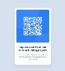
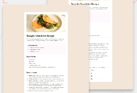

  

# Pablo Zallio - Frontend Developer 

 Hello 🙋‍♂️, my name is Pablo, I'm a ***Frontend developer*** and I'm passionate about transforming ideas into attractive and functional experiences, always learning and improving my skills.

Here you can learn a little more about me, what I know and what I do.

## Projects 👷‍♂️

| Project | Image | Description | Tecnologies |
| --- | --- | --- | --- |
| [QR Component](https://component-qr-card.netlify.app/) |  | Card with QR code | HTML, CSS, Tailwind
| [Recipe page](https://rice-page.netlify.app/) |  | Recipes page | HTML, Css, Tailwind

## Contact 👇

