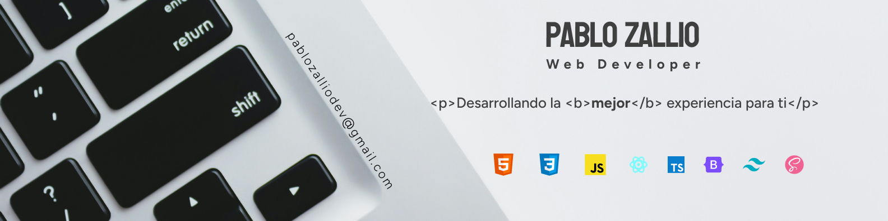

 <h1>
Pablo Zallio - pd Developer 
</h1>

<!-- Newsletter sign-up form with success message -->

<h3> Apasionado por transformar ideas en experiencias digitales atractivas y funcionales. </h3>

## Conoceme..

 ¡Hola! 🙋‍♂️ Soy Pablo, trabajo dia a dia para dar vida a los diseños y transformarlos en soluciones web excepcionales. 
 
 **Mi enfoque:** crear interfaces que sean no solo atractivas, sino también intuitivas, accesibles y robustas 💪.
 Siempre estoy buscando las últimas herramientas y mejores prácticas en el ecosistema Frontend, para mí, el desarrollo es un viaje constante de aprendizaje y mejora continua.

**Mi objetivo:** Escribir código limpio y modular que no solo funcione perfectamente, sino que también facilite el mantenimiento y la colaboración en equipo.

## Conectate conmigo

Este es mi Linkedin, en el encontraras mis trabajos y mucha informacion sobre contenido dekl mundo ***Front***

Y por aqui mi correo, no dudes en contactarme con cualquier duda!

