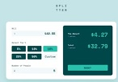
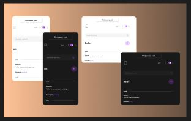

  

 <h1> Pablo Zallio - Frontend Developer </h1> 

 Hola 🙋‍♂️, mi nombre es Pablo, soy ***Frontend developer*** y me apasiona transformar ideas en experiencias atractivas y funcionales, siempre aprendiendo y mejorando mis habilidades.

Aquí podrás conocer un poco más sobre mí, lo que sé y lo que hago.

<h2 style="margin-top: 100px">Proyectos

| Proyecto | Tecnologias | Imagen | Right-aligned |
| :---:    |     :---:      |           :---: |          :---: |
| Tip Calculator App   [Frontend Mentor](https://www.frontendmentor.io/challenges/tip-calculator-app-ugJNGbJUX)    | HTML - CSS     |     | [GitHub](https://github.com/Pablo-Zallio-Dev/meet__landing__page) - [Netlify](https://landingmeet.netlify.app/)     |
| Oh Studio Projects   [Frontend Practice](https://www.frontendpractice.com/projects/oh-studio)      | HTML - CSS - JavaScript |        | [GitHub](https://github.com/Pablo-Zallio-Dev/oh-studio) - [Netlify](https://oh-studio-landing.netlify.app/)      |
| Dictionary Web   [Frontend Practice](https://www.frontendpractice.com/projects/oh-studio)      | React - CSS - TypeScript |        | [GitHub](https://github.com/Pablo-Zallio-Dev/dictionary-app) - [Vercel](https://dictionary-app-one-gamma.vercel.app/)      |

<!-- Newsletter sign-up form with success message -->

<h2 style="margin-top: 100px">Herramientas y Lenguajes

### Estructuracion de codigo

### Diseños y estilos

### Programacion

### Control de versiones

### Diseño & Software

