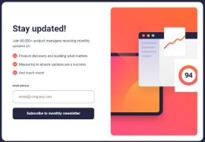

  

 <h1> Pablo Zallio - Frontend Developer </h1> 

 Hola 🙋‍♂️, mi nombre es Pablo, soy ***Frontend developer*** y me apasiona transformar ideas en experiencias atractivas y funcionales, siempre aprendiendo y mejorando mis habilidades.

Aquí podrás conocer un poco más sobre mí, lo que sé y lo que hago.

<h2 style="margin-top: 100px">Proyectos

| Proyecto | Tecnologias | Imagen | Right-aligned |
| :---:    |     :---:      |           :---: |          :---: |
| Meet landing page   [Frontend Mentor](https://www.frontendmentor.io/challenges/meet-landing-page-rbTDS6OUR)    | HTML - CSS     |     | [GitHub](https://github.com/Pablo-Zallio-Dev/meet__landing__page) - [Netlify](https://landingmeet.netlify.app/)     |
| Newsletter sign-up form with success message   [Frontend Mentor](https://www.frontendmentor.io/challenges/newsletter-signup-form-with-success-message-3FC1AZbNrv)      | HTML - CSS - JavaScript |        | [GitHub](https://github.com/Pablo-Zallio-Dev/newsletter-sign-up-) - [Netlify](https://sign-up-news.netlify.app/)      |

<!-- Newsletter sign-up form with success message -->

<h2 style="margin-top: 100px">Herramientas y Lenguajes

### Estructuracion de codigo

  HTML5

### Diseños y estilos

### Programacion

### Control de versiones

### Diseño & Software

