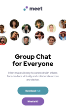

  

 <h1> Pablo Zallio - Frontend Developer </h1> 

 Hola 🙋‍♂️, mi nombre es Pablo, soy ***Frontend developer*** y me apasiona transformar ideas en experiencias atractivas y funcionales, siempre aprendiendo y mejorando mis habilidades.

Aquí podrás conocer un poco más sobre mí, lo que sé y lo que hago.

<h2 style="margin-top: 100px">Proyectos

Meet landing page - [Frontend Mentor](https://www.frontendmentor.io/challenges/meet-landing-page-rbTDS6OUR) / HTML - CSS /  [GitHub](https://github.com/Pablo-Zallio-Dev/meet__landing__page) - [Netlify](https://landingmeet.netlify.app/)  
Newsletter sign-up form with success message - [Frontend Mentor](https://www.frontendmentor.io/challenges/newsletter-signup-form-with-success-message-3FC1AZbNrv) / HTML - CSS - JavaScript / [GitHub](https://github.com/Pablo-Zallio-Dev/newsletter-sign-up-) / [Netlify](https://sign-up-news.netlify.app/)

| Left-aligned | Center-aligned | Center-aligned | Right-aligned |
| :---         |     :---:      |           ---: |          ---: |
| git status   | git status     |  git status    | git status    |
| git diff     | git diff       |  git diff      | git diff      |

<!-- 

<h3 style="width: 200px">Proyectos</h3> | <h3 style="width: 200px">Herramientas</h3> | <h3 style="width: 200px">Imagen</h3> | <h3 style="width: 200px">Links</h3>
:----:|:----:|:----:|:----
 | HTML - CSS  |  | [GitHub](https://github.com/Pablo-Zallio-Dev/meet__landing__page) / [Netlify](https://landingmeet.netlify.app/)
Newsletter sign-up form with success message   [Frontend Mentor](https://www.frontendmentor.io/challenges/newsletter-signup-form-with-success-message-3FC1AZbNrv) | HTML - CSS - JavaScript  |  | [GitHub](https://github.com/Pablo-Zallio-Dev/newsletter-sign-up-) / [Netlify](https://sign-up-news.netlify.app/)

 -->

<!-- Newsletter sign-up form with success message -->

<h2 style="margin-top: 100px">Herramientas y Lenguajes

### Estructuracion de codigo

  HTML5

### Diseños y estilos

### Programacion

### Control de versiones

### Diseño & Software

